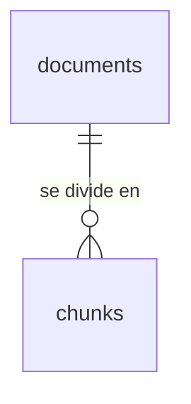

# RAG Backend

Backend de un sistema **RAG (Retrieval-Augmented Generation)** para responder consultas en lenguaje natural usando como fuente una base de conocimiento documental propia, con respuestas fundamentadas y trazables a sus fuentes.

Este proyecto es una **reescritura desde cero** de un sistema RAG que ya fue validado en producción y publicado en una investigación científica (ver [Origen](#origen)). Conserva el problema. El stack, los modelos y el diseño son nuevos.

---

## Tabla de contenidos

- [Origen](#origen)
- [Objetivos](#objetivos)
- [Stack](#stack)
- [Arquitectura](#arquitectura)
- [Estructura del proyecto](#estructura-del-proyecto)
- [Requisitos](#requisitos)
- [Instalación](#instalación)
- [Variables de entorno](#variables-de-entorno)
- [Base de datos](#base-de-datos)
- [Ejecución](#ejecución)
- [Tests](#tests)
- [Calidad de código](#calidad-de-código)
- [Convenciones](#convenciones)
- [Roadmap](#roadmap)
- [Investigación](#investigación)
- [Autores](#autores)

---

## Origen

La primera versión fue un asistente de trámites municipales para la Municipalidad de Carabayllo (Lima, Perú). Se evaluó con un diseño experimental con grupo de control (n = 30 por grupo) y obtuvo mejoras estadísticamente significativas (p < 0.001) en los cuatro indicadores:

| Indicador | Canal tradicional | Asistente RAG |
| --- | --- | --- |
| Consultas atendidas / día | 64.53 | **94.20** |
| Exactitud de respuesta | 86.50 % | **92.97 %** |
| Tiempo de espera | ~4.5 días | **~22 min** |
| Satisfacción del usuario | Mayoría en desacuerdo | Mayoría de acuerdo |

Los resultados están publicados en el artículo citado en [Investigación](#investigación).

---

## Objetivos

- Respuestas **fundamentadas** solo en la base de conocimiento, con **citas a la fuente**.
- Pipeline de ingesta y recuperación **configurable y reemplazable** (modelos, chunking, vector store).
- **Evaluación medible** de la calidad del RAG, no solo feedback manual.
- Código tipado, testeado y desacoplado de proveedores.

---

## Stack

| Componente | Tecnología |
| --- | --- |
| Lenguaje | Python 3.10+ |
| Framework HTTP | FastAPI |
| LLM | claude-sonnet-5-5 |
| Embeddings | _Por definir_ |
| Vector store | PostgreSQL + pgvector (Supabase) |
| Persistencia | SQLAlchemy async + asyncpg, migraciones con Alembic |
| Contenedores | Docker + Docker Compose |
| Testing | Pytest, pytest-asyncio, pytest-cov |
| Calidad | Ruff, mypy, pre-commit, GitHub Actions |

---

## Arquitectura

El código se organiza en capas. **Las dependencias apuntan hacia adentro** y los proveedores externos quedan detrás de interfaces.

| Capa | Responsabilidad | Depende de |
| --- | --- | --- |
| `domain` | Entidades e interfaces (puertos). Python puro, sin frameworks ni SDKs. | Nada |
| `application` | Casos de uso que orquestan el dominio. | `domain` |
| `infrastructure` | Adaptadores concretos: LLM, embeddings, vector store, base de datos, loaders. | `domain`, `application` |
| `interfaces` | API HTTP: routers, schemas e inyección de dependencias. | `application`, `domain` |

---

## Estructura del proyecto

```
rag/
├── src/
│   ├── domain/            # entities, ports, exceptions
│   ├── application/
│   │   └── answer/        # caso de uso AnswerQuery
│   ├── infrastructure/
│   │   ├── db/            # modelos ORM
│   │   └── llm/           # adaptador de Anthropic
│   ├── interfaces/
│   │   ├── routers/
│   │   ├── schemas/
│   │   └── dependencies/
│   ├── config.py
│   └── main.py
├── migrations/            # migraciones de Alembic
├── tests/
├── requirements/
│   ├── requirements.txt   # producción
│   └── tests.txt          # desarrollo: lint, tipos, tests
├── .env.example
├── .pre-commit-config.yaml
├── alembic.ini
├── docker-compose.yml
├── dockerfile
└── pyproject.toml
```

---

## Requisitos

- Python 3.10+
- API key de Anthropic creada **dentro de un workspace** ([platform.claude.com](https://platform.claude.com))
- Proyecto de [Supabase](https://supabase.com) (PostgreSQL con pgvector)
- Docker y Docker Compose (opcional)

---

## Instalación

```bash
git clone https://github.com/Kev-1729/RAG-Backend-Carabayllo.git
cd RAG-Backend-Carabayllo

python -m venv .venv
# Linux / macOS
source .venv/bin/activate
# Windows (PowerShell)
.venv\Scripts\Activate.ps1

pip install -r requirements/tests.txt
pre-commit install
cp .env.example .env   # completa las variables (ver abajo)
alembic upgrade head   # crea el esquema en tu base de datos
```

Cada desarrollador usa su propio proyecto de Supabase. Después de un `git pull` que traiga migraciones nuevas, vuelve a ejecutar `alembic upgrade head`.

---

## Variables de entorno

Copia `.env.example` a `.env` y completa los valores. **Nunca subas `.env` al repositorio.**

| Variable | Requerida | Descripción |
| --- | --- | --- |
| `ANTHROPIC_API_KEY` | Sí | API key de Anthropic (scoped a un workspace) |
| `LLM_MODEL` | Sí | Modelo a usar, p. ej. `claude-sonnet-5-5` |
| `DATABASE_URL` | Sí | Conexión a PostgreSQL. En Supabase: **Connect → Direct → Session pooler**, cambiando `postgresql://` por `postgresql+asyncpg://` y agregando `?ssl=require` |
| `CORS_ALLOW_ORIGINS` | No | Orígenes permitidos separados por coma |

---

## Base de datos



| Tabla | Propósito |
| --- | --- |
| `documents` | Un registro por PDF ingerido. El `sha256` del archivo evita ingerir el mismo documento dos veces. |
| `chunks` | Fragmentos de cada documento con su página (para las citas) y su embedding (`vector(1024)`), indexado con HNSW para la búsqueda por similitud. |

El detalle de columnas está en [`src/infrastructure/db/models.py`](src/infrastructure/db/models.py) y en [`migrations/versions/`](migrations/versions/). Todas las tablas tienen **RLS activado** para que la Data API de Supabase no pueda acceder a ellas; el backend se conecta directo a PostgreSQL.

```bash
alembic upgrade head                                  # aplica las migraciones pendientes
alembic downgrade -1                                  # revierte la última
alembic revision --autogenerate -m "descripción"      # crea una migración a partir de los modelos
alembic check                                         # verifica que modelos y base estén sincronizados
```

**Reglas**

- El esquema **nunca** se modifica desde el dashboard de Supabase: todo cambio es una migración nueva en un PR.
- Las migraciones autogeneradas se revisan antes de commitear (extensiones y RLS se agregan a mano).
- Una migración ya aplicada en otra base no se edita; se corrige con una nueva.

---

## Ejecución

```bash
uvicorn src.main:app --reload --port 8000
```

Documentación interactiva: http://localhost:8000/docs

```bash
curl -X POST http://localhost:8000/query \
  -H "Content-Type: application/json" \
  -d '{"question": "¿Qué necesito para sacar una licencia de funcionamiento?"}'
```

---

## Tests

```bash
pytest
```

Los proveedores externos se mockean en los tests unitarios. Se exige una cobertura mínima del **80 %** sobre `src/application`.

---

## Calidad de código

```bash
pre-commit run --all-files
```

| Herramienta | Uso |
| --- | --- |
| Ruff | Linter, orden de imports y formateo (88 columnas) |
| mypy | Tipado estático; toda función debe estar anotada |

Estas mismas verificaciones, más `pytest`, corren en GitHub Actions en cada pull request.

---

## Convenciones

**Ramas**: `main` · `feat/*` · `fix/*` · `chore/*` · `refactor/*` · `docs/*`

**Commits**: [Conventional Commits](https://www.conventionalcommits.org/)

**Reglas de arquitectura**

- `domain` no importa frameworks ni SDKs externos.
- Los casos de uso reciben interfaces por constructor, nunca implementaciones.
- Los routers validan la entrada, llaman a un caso de uso y mapean la respuesta.
- Ningún endpoint expone errores internos al cliente.

---

## Roadmap

- [x] Estructura base y tooling
- [x] Configuración con `pydantic-settings`
- [x] Dominio: entidades y puertos
- [x] Endpoint de consulta conectado al LLM (sin retrieval)
- [x] Base de datos: PostgreSQL + pgvector con migraciones (Alembic)
- [ ] Ingesta de documentos (PDF y otros formatos) con chunking configurable
- [ ] OCR para documentos escaneados
- [ ] Consulta RAG con citas a la fuente
- [ ] Memoria conversacional
- [ ] Feedback de usuarios y métricas de exactitud
- [ ] Evaluación automática del pipeline
- [ ] Streaming de respuestas
- [ ] Autenticación
- [x] CI (GitHub Actions)
- [ ] Despliegue (CD)

---

## Investigación

> Collado, J., & Tupac-Agüero, K. (`2026`). _Efectos del uso de un Asistente Inteligente con RAG para el Acceso a Información y Consultas sobre Servicios Públicos: Un estudio de caso en Lima, Perú_.

---

## Autores

- **Kevin Tupac-Agüero** · Universidad Nacional Mayor de San Marcos · [@Kev-1729](https://github.com/Kev-1729)
- **Jhair Collado** · Universidad Nacional Mayor de San Marcos
